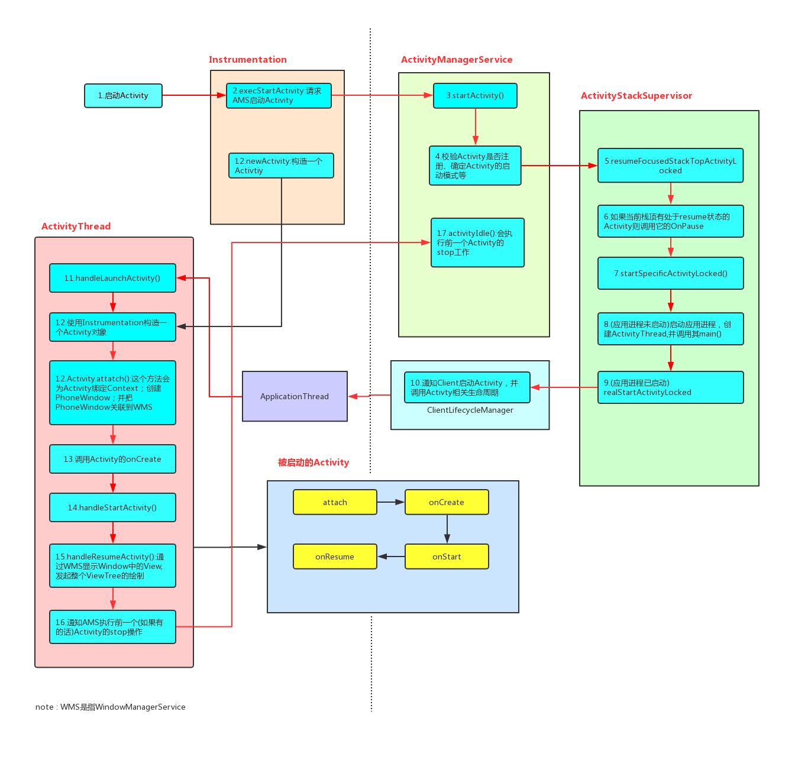

>Activity启动相关源码比较复杂、涉及到的链路较多，我经常在理清楚一遍之后过一段时间再阅读就和第一次读一样，依旧要费一番功夫才能理清。为了加深对Activity启动过程的理解也方便以后回顾因此我把整个Activity的启动过程总结为一张图。此图基于9.0的Android源码(Activty相关代码虽然在不断重构但核心逻辑还是没变的)。

## 图中相关模块的作用

## ActivityThread

可以把它理解为应用运行的**主线类**，它的主要功能有:

#### 包含了应用的入口 : main()

这个函数主要做了下面工作:

1. 利用`ApplicationThread`建立了应用与`AMS`的链接。
2. 构造了`Instrumentation`。
3. 创建了应用的`Application`。
4. 开启了主线程的消息处理模型。

#### 管理应用四大组件的运行

## ApplicationThread

它是应用程序在`AMS`中的`Binder`对象，`AMS`利用它可以和`ActivityThread`通信，四大组件相关回调都是通过它来告诉`ActivityThread`的。

### Instrumentation

这个类伴随着`ActivityThread`一块诞生，主要用来帮助`ActivityThread`来管理`Activity`相关工作。它持有着`AMS`在应用端的`Binder`，`ActivityThread`主要通过它来和`AMS`通信。

## ActivityManagerService

它是Android最核心的服务，主要管理着Android系统中四大组件的运行，

## ActivityStackSupervisor

负责所有Activity栈的管理。内部管理了mHomeStack、mFocusedStack和mLastFocusedStack三个Activity栈。其中，mHomeStack管理的是Launcher相关的Activity栈；mFocusedStack管理的是当前显示在前台Activity的Activity栈；mLastFocusedStack管理的是上一次显示在前台Activity的Activity栈。

## ClientLifecycleManager

帮助`AMS`回调应用程序四大组件生命周期相关方法。

>参考文章

>

## The End

**欢迎关注我的[Android进阶计划](https://github.com/SusionSuc/AdvancedAndroid)看更多干货**

**欢迎关注我的微信公众号:susion随心**

