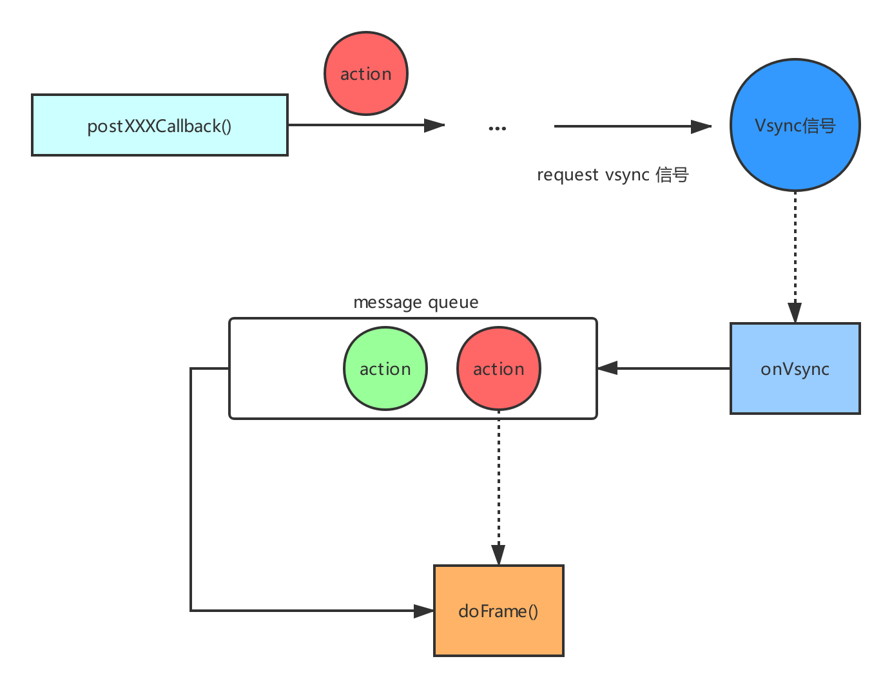

>为了更好的理解`App FPS`监控的原理，本文先来梳理一下`Choreographer`的工作原理。

# 对 Vsync 信号的监听

`Choreographer`会通过`Choreographer.FrameDisplayEventReceiver`来监听底层`HWC`触发的`Vsync`信号:

```
private final class FrameDisplayEventReceiver extends DisplayEventReceiver implements Runnable {
    @Override
    public void onVsync(long timestampNanos, int builtInDisplayId, int frame) {

    }
}
```

`Vsync`信号可以理解为底层硬件的一个系统中断，它每16ms会产生一次。上面`onVsync()`的每个参数的意义为:

>timestampNanos : Vsync信号到来的时间, 这个时间使用的是底层`JVM nanoscends -> System.nanoTime`

>builtInDisplayId : 此时`SurfaceFlinger`内置的`display id`

>frame : 帧号，随着`onVsync`的回调数增加

## onVsync的回调逻辑

那`onVsync`什么时候会调用呢? 

`Choreographer.scheduleVsyncLocked()`会请求下一次`Vsync`信号到来时回调`FrameDisplayEventReceiver.onVsync()`方法:

```
private void scheduleVsyncLocked() {
    mDisplayEventReceiver.scheduleVsync();
}
```

# Vsync信号到来时执行callback

## 设置callback

`Choregrapher`提供类下面方法设置`callback`:

```
public void postCallback(int callbackType, Runnable action, Object token) 
public void postCallbackDelayed(int callbackType, Runnable action, Object token, long delayMillis)
public void postFrameCallback(FrameCallback callback)
public void postFrameCallbackDelayed(FrameCallback callback, long delayMillis) 
```

在`Choregrapher`中存在多个`Callback Queue`, 常见的`Callback Queue`的类型有:

```
Choreographer.CALLBACK_INPUT       输入事件，比如键盘
Choreographer.CALLBACK_ANIMATION   动画
Choreographer.CALLBACK_TRAVERSAL   比如`ViewRootImpl.scheduleTraversals, layout or draw`
Choreographer.CALLBACK_COMMIT           
```

上面4个事件会在一次`Vsync`信号到来时依次执行。


## callback的执行逻辑

以`ViewRootImpl.scheduleTraversals`为例:

```
void scheduleTraversals() {
    ...
    mChoreographer.postCallback(
        Choreographer.CALLBACK_TRAVERSAL, mTraversalRunnable, null);
}
```

即给`Choregrapher`提交了一个`Choreographer.CALLBACK_TRAVERSAL`类型的`callback`去执行。

`postCallback()`里面的具体执行逻辑就不分析了，这里直接说一下关键逻辑:

1. 切换到 `Choregrapher`创建时所在的线程去调用`scheduleFrameLocked()`方法,设置`mFrameScheduled = true`
2. 调用`scheduleVsyncLocked`请求下一次`Vsync`信号回调
3. `FrameDisplayEventReceiver.onVsync()`会生成一个消息，然后发送到`Choreographer`的消息队列
4. `Choreographer`取出上面`onVsync`中发送的消息，执行`Choreographer.doFrame()`方法，`doFrame()`中判断`mFrameScheduled`是否为`true`,如果为`true`的话就上面四种`callback`


综上所述`Choreographer`的工作原理如下图:



## doFrame() 的时间参数

我们来看一下这个方法(主要关注一下时间参数):

```
void doFrame(long frameTimeNanos, int frame) {

    final long startNanos;
    if (!mFrameScheduled) {
        return; // no work to do
    }

    long intendedFrameTimeNanos = frameTimeNanos; 
    startNanos = System.nanoTime();

    final long jitterNanos = startNanos - frameTimeNanos;

    if (jitterNanos >= mFrameIntervalNanos) {  //16ms
        final long skippedFrames = jitterNanos / mFrameIntervalNanos;
        final long lastFrameOffset = jitterNanos % mFrameIntervalNanos;
        frameTimeNanos = startNanos - lastFrameOffset;      
    }

    mFrameInfo.setVsync(intendedFrameTimeNanos, frameTimeNanos);
    mFrameScheduled = false;
    mLastFrameTimeNanos = frameTimeNanos;

    doCallbacks(Choreographer.CALLBACK_INPUT, frameTimeNanos);

    doCallbacks(Choreographer.CALLBACK_ANIMATION, frameTimeNanos);

    doCallbacks(Choreographer.CALLBACK_TRAVERSAL, frameTimeNanos);

    doCallbacks(Choreographer.CALLBACK_COMMIT, frameTimeNanos);
}
```

解释一下上面一些时间相关参数的含义:

> intendedFrameTimeNanos: 预计这一帧开始渲染的时间

> frameTimeNanos: 这一帧真正开始渲染的时间。在 `startNanos - frameTimeNanos < mFrameIntervalNanos`,其实就等于`intendedFrameTimeNanos`

> jitterNanos: 真正渲染时间点和预计渲染时间点之差 

> mFrameIntervalNanos: 每一帧期望渲染的时间， 固定为16ms

> skippedFrames : jitterNanos总共跳过了多少帧。 

> mLastFrameTimeNanos : 上一次渲染一帧的时间点


那 `jitterNanos > mFrameIntervalNanos` 在什么时候会成立呢?

其实就是我们常说的**丢帧**: 比如我们连续提交了两个`Choreographer.CALLBACK_TRAVERSAL callback`。如果一个`callback`的执行时间大于16ms,那么就会造成:

```
startNanos - frameTimeNanos > mFrameIntervalNanos(16ms)
```

