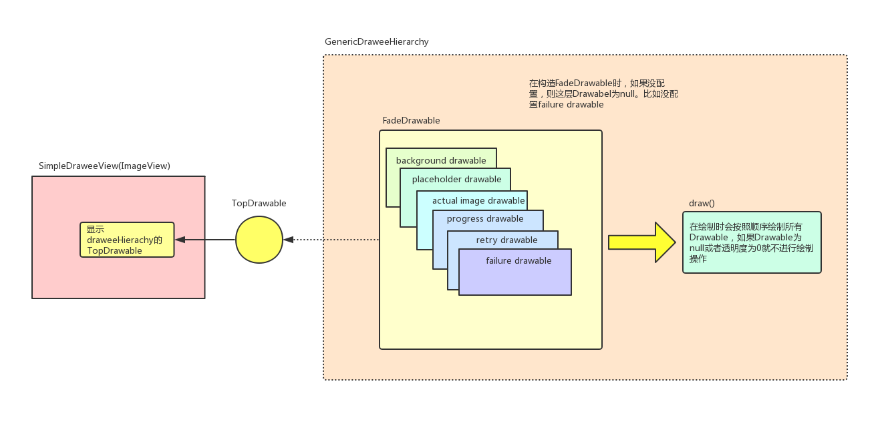

[(第一篇)Fresco架构设计赏析](Fresco架构设计赏析.md)

[(第二篇)Fresco缓存架构分析](Fresco缓存架构分析.md)

>本文是Fresco源码分析系列第三篇文章，主要来分析一下`Fresco UI`层的实现，包括下面这些点:

1. 图片显示原理，图片加载过程中各个阶段的图片切换原理。(比如由占位图->目标图片)
2. 圆角的实现
3. ScaleType的实现

# 图片显示原理与多状态切换逻辑

在`Fresco`中负责图片展示工作的是`DraweeHierarchy`,它内部维护着一个`Drawable`序列,在图片加载过程中的不同阶段可以显示不同状态的`Drawable`。

## 图片显示原理

我们一般直接使用`SimpleDraweeView`,它继承自`DraweeView`:

>DraweeView.java
```
public class DraweeView<DH extends DraweeHierarchy> extends ImageView {

    public void setController(@Nullable DraweeController draweeController) {
        mDraweeHolder.setController(draweeController);
        super.setImageDrawable(mDraweeHolder.getTopLevelDrawable()); 
    }
}
```

在调用`SimpleDraweeView.setImageUri()`时会调用到`DraweeView.setController()`,即此时是直接显示的`mDraweeHolder.getTopLevelDrawable()`:

>DraweeHolder.java
```
public @Nullable Drawable getTopLevelDrawable() {
    return mHierarchy == null ? null : mHierarchy.getTopLevelDrawable();
}
```

所以最终的显示的`Drawable`是`mHierarchy.getTopLevelDrawable()`。`mHierarchy`的实现是`GenericDraweeHierarchy`。`mHierarchy.getTopLevelDrawable()`获取的`Drawable`实际上可以理解为`FadeDrawable`:

>GenericDraweeHierarchy.java
```
    GenericDraweeHierarchy(GenericDraweeHierarchyBuilder builder) {
        mFadeDrawable = new FadeDrawable(layers);
        Drawable maybeRoundedDrawable = WrappingUtils.maybeWrapWithRoundedOverlayColor(mFadeDrawable, mRoundingParams);
        mTopLevelDrawable = new RootDrawable(maybeRoundedDrawable); //RootDrawable 只是一个装饰类
    }
``` 

`FadeDrawable`内部维护着一个`Drawable`数组，它可以由一个`Drawable`切换到另一个`Drawable`，`Drawable`的切换过程中伴有着透明度改变的动画:

```
public class FadeDrawable extends ArrayDrawable {
    private final Drawable[] mLayers;
    
    @Override
    public void draw(Canvas canvas) {
        ...更新Drawable的透明度

        //从前往后一层一层的画出来
        for (int i = 0; i < mLayers.length; i++) {
            drawDrawableWithAlpha(canvas, mLayers[i], mAlphas[i] * mAlpha / 255);
        }
    }
}
```

那`Fresco`中一共有多少层`Drawable(layer)`呢？我们看一下`GenericDraweeHierarchy`的初始化代码:

>GenericDraweeHierarchy.java
```
    private static final int BACKGROUND_IMAGE_INDEX = 0;
    private static final int PLACEHOLDER_IMAGE_INDEX = 1;
    private static final int ACTUAL_IMAGE_INDEX = 2;
    private static final int PROGRESS_BAR_IMAGE_INDEX = 3;
    private static final int RETRY_IMAGE_INDEX = 4;
    private static final int FAILURE_IMAGE_INDEX = 5;
    private static final int OVERLAY_IMAGES_INDEX = 6;

    GenericDraweeHierarchy(GenericDraweeHierarchyBuilder builder) {
        Drawable[] layers = new Drawable[numLayers];  // 一般是6层
        layers[BACKGROUND_IMAGE_INDEX] = ...
        layers[PLACEHOLDER_IMAGE_INDEX] = ...
        layers[ACTUAL_IMAGE_INDEX] = ...
        layers[PROGRESS_BAR_IMAGE_INDEX] = ...
        layers[RETRY_IMAGE_INDEX] = ...
        layers[FAILURE_IMAGE_INDEX] = ...
        ...这里还有一个overlayer层
    }
```

即在构造`GenericDraweeHierarchy`就确定了有几层`Drawable`(`Fresco`中`numLayers`的值一般为`6`)。当然如果没有这一层`Drawable`(比如没有提供`Progress Drawable`),那么这一层`Drawable`就是null。通过`FadeDrawable.draw()`已经知道会按照顺序把这些`Drawable`都画出来(Drawable为null的话就不会画, 透明度为0也不会画)。

可以看到我们实际上要显示的图片位于第3层级。那么如果图片加载完成，如何从加载进度的`Drawable`切换到实际的图片呢？:

>GenericDraweeHierarchy.java
```
public void setImage(Drawable drawable, float progress, boolean immediate) {
    drawable = WrappingUtils.maybeApplyLeafRounding(drawable, mRoundingParams, mResources); //包裹上圆形参数
    ...
    fadeOutBranches();
    fadeInLayer(ACTUAL_IMAGE_INDEX);
    ...
}

private void fadeOutBranches() {
    fadeOutLayer(PLACEHOLDER_IMAGE_INDEX);
    fadeOutLayer(ACTUAL_IMAGE_INDEX);
    fadeOutLayer(PROGRESS_BAR_IMAGE_INDEX);
    fadeOutLayer(RETRY_IMAGE_INDEX);
    fadeOutLayer(FAILURE_IMAGE_INDEX);
}
```

当加载完成完最终图片后就会调用到`GenericDraweeHierarchy.setImage()`，上面逻辑其实涉及到的代码很多，但是逻辑很简单就不深入看了。上面的两个核心方法可以这样理解:

- fadeOutLayer() : 把这一层Drawable(layer)的透明度设置为0
- fadeInLayer() : 把这一层的透明度设置为1

到这里，基本上就叙述了`Fresco`的图片显示原理。其实整体流程可以用下图表示:



# 圆角的实现

直接来看具体的实现代码:

>WrappingUtils.java
```
private static Drawable applyLeafRounding(Drawable drawable, RoundingParams roundingParams, Resources resources) {
    if (drawable instanceof BitmapDrawable) {
        final BitmapDrawable bitmapDrawable = (BitmapDrawable) drawable;
        RoundedBitmapDrawable roundedBitmapDrawable = new RoundedBitmapDrawable(resources,bitmapDrawable.getBitmap(),bitmapDrawable.getPaint());
        applyRoundingParams(roundedBitmapDrawable, roundingParams);
        return roundedBitmapDrawable;
    }
    ...
    return drawable;
}
```

>RoundedBitmapDrawable.java
```
    @Override
    public void draw(Canvas canvas) {
        if (!shouldRound()) {
            super.draw(canvas);
            return;
        }
        ...
        updatePath(); //更新圆角path or 圆形path
        updatePaint();
        ...
        canvas.drawPath(mPath, mPaint);
    }

    private void updatePaint() {
        if (mLastBitmap == null || mLastBitmap.get() != mBitmap) {
            mLastBitmap = new WeakReference<>(mBitmap);
            mPaint.setShader(new BitmapShader(mBitmap, Shader.TileMode.CLAMP, Shader.TileMode.CLAMP));
            mIsShaderTransformDirty = true;
        }
        ...
    }
```

即`Fresco`的圆角实际上是使用`BitmapShader`来实现的。

# ScaleType的实现

`Fresco`的`ScaleType`的实现原理其实和`ImageView`是相同的。但由于`SimpleDraweeView`内部是维护了多个`Drawable`，所以它并不能直接使用`ImageView`的实现方式，它需要把它维护的每一个`Drawable`都做对应的`ScaleType`操作。我们先来看一下`ImageView`的`ScaleType`的实现:

## ImageView ScaleType的实现

>ImageView中 CENTER_CROP 的实现
```
    private void configureBounds() {
        //drawable 的宽高
        final int dwidth = mDrawableWidth;  
        final int dheight = mDrawableHeight;

        //当前view的宽高
        final int vwidth = getWidth() - mPaddingLeft - mPaddingRight;
        final int vheight = getHeight() - mPaddingTop - mPaddingBottom;

        ...
        if (ScaleType.CENTER_CROP == mScaleType) {
            mDrawMatrix = mMatrix;

            float scale;
            float dx = 0, dy = 0;

            if (dwidth * vheight > vwidth * dheight) {
                scale = (float) vheight / (float) dheight;
                dx = (vwidth - dwidth * scale) * 0.5f;
            } else {
                scale = (float) vwidth / (float) dwidth;
                dy = (vheight - dheight * scale) * 0.5f;
            }

            mDrawMatrix.setScale(scale, scale);
            mDrawMatrix.postTranslate(Math.round(dx), Math.round(dy)); // 从哪个坐标开始画 Drawable
        }
        ...
    }
```

## Fresco的实现

在`Fresco`中如果对图片设置了`ScaleType`，那么就会把对应的`Drawable`封装为`ScaleTypeDrawable`, 它的`draw()`:

```
    public void draw(Canvas canvas) {
        // 这个方法类似于 ImageView configureBounds的实现， 配置了 mDrawMatrix
        configureBoundsIfUnderlyingChanged(); 
        if (mDrawMatrix != null) {
            int saveCount = canvas.save();
            canvas.clipRect(getBounds());
            canvas.concat(mDrawMatrix);
            super.draw(canvas);
            canvas.restoreToCount(saveCount);
        } else {
            super.draw(canvas);
        }
    }
```


