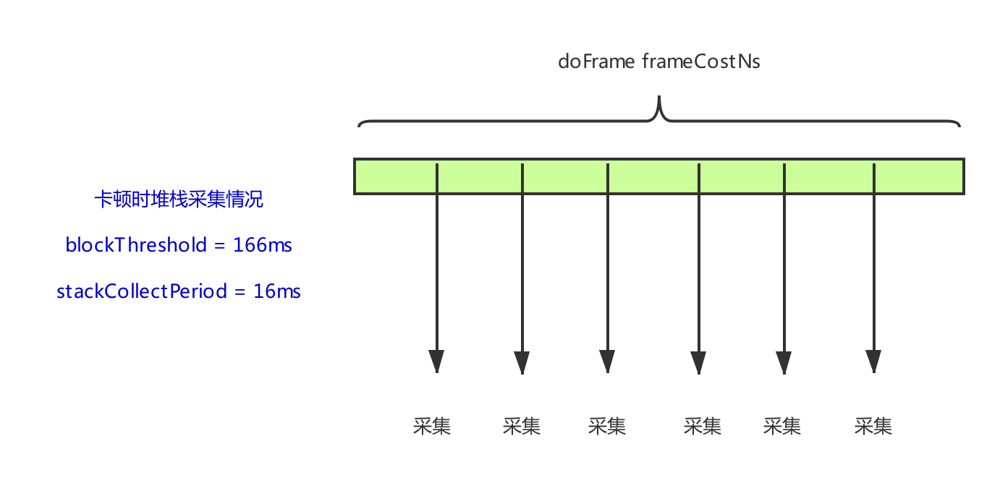
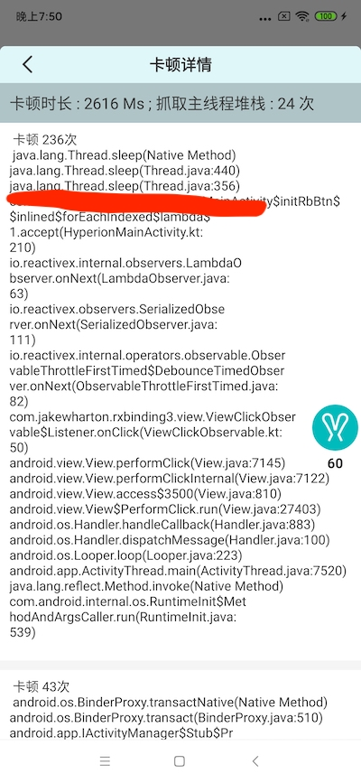

本文所讲的**卡顿监控原理**也是基于`Choreographer`的,在继续阅读之前可以看一下这两篇文章来保证可以更好的理解本文的内容:

[Choreographer工作逻辑总结](Choreographer工作逻辑总结.md)

[应用流畅度(FPS)监控](应用流畅度(FPS)监控.md)

>本文卡顿监控的实现思路主要参考自:[fpsviewer](https://github.com/SilenceDut/fpsviewer)。本文主要概括性的讲一下实现原理

## 如何确定应用发生了卡顿?

根据我们前面的文章我们知道`Choreographer.doFrame()`方法必须要在**16.67ms**以内完成才不会导致应用丢帧,因此如果一个`Choreographer.doFrame()`执行时间超过了**16.67ms**是可以认为应用
发生了卡顿,那么如何确定`Choreographer.doFrame()`的执行时间呢？

### 计算 Choreographer.doFrame() 的执行时间

其实`Choreographer`提供了一个API:`postFrameCallback()`:

```
Choreographer.getInstance().postFrameCallback(object :Choreographer.FrameCallback{
    override fun doFrame(frameTimeNanos: Long) {
    
    }
})
```

>这个Callback会在`Choreographer.doFrame()`中回调。

上面`doFrame(frameTimeNanos: Long)`的`frameTimeNanos`参数的含义是: **这一帧真正开始执行的时间点**, 所以我们可以通过计算两个`Choreographer.FrameCallback`的时间间隔来推断出
`Choreographer.doFrame()`到底执行了多长时间, 大概代码如下:

```
Choreographer.getInstance().postFrameCallback(object :Choreographer.FrameCallback{
    override fun doFrame(frameTimeNanos: Long) {
        if (mLastFrameTimeNanos != 0L) {
            val diffFrameCoast = (frameTimeNanos - mLastFrameTimeNanos) //计算一个doFrame消耗的时间
            mFrameListeners.forEach {
                it.doFrame(diffFrameCoast)
            }
        }
        mLastFrameTimeNanos = frameTimeNanos
        Choreographer.getInstance().postFrameCallback(this)
    }
})
```

即上面不断循环调用`Choreographer.getInstance().postFrameCallback(this)`(这样会导致`Choreographer`不断请求`Vsync`信号来回调`Choreographer.doFrame()`方法), 并计算出`doFrame`方法的执行时间，然后通知给观察者。

### 捕获卡顿

上面我们已经拿到了`Choreographer.doFrame()`的执行时间，那么我们只需要定义一个卡顿阈值就就可以判断是否产生了卡顿了:

```
class RabbitBlockMonitor : ChoreographerFrameUpdateMonitor.FrameUpdateListener {

    val blockThreshold = 16666666 * 10

    override fun doFrame(frameCostNs: Long) {

        if (frameCostNs > blockThreshold) {
            toastInThread("检测到卡顿!!")
        }
    }
}
```

上面我简单的把卡顿的检测阈值定为10帧(10 * 16.67)。


## 如何捕获卡顿发生时的堆栈？

其实对于堆栈的获取主要有两个问题:

1. 获取主线程的堆栈可能会导致主线程卡顿
2. 获取某个时间点的堆栈只是该时刻的一个**堆栈快照**, 那么如何在卡顿发生时，获取到前面卡顿时的堆栈呢?


对于上面第一个问题**我们可以在子线程中获取主线程的堆栈。**, 不过要在现在时刻获取历史时刻的堆栈就比较困难了。。这里我们采用另一个方法 : **周期性的采集主线程堆栈**

- 周期性的采集主线程堆栈

我们可以每隔**10ms**在异步线程获取一下主线程的堆栈然后保存起来，在卡顿发生时，把这些周期性采集的堆栈当做**卡顿时的堆栈**。这种方法可以抓住大部分卡顿现场,不过也会获取一些无用的堆栈信息。

>下面来看一下具体实现方法:

```
class RabbitBlockMonitor : ChoreographerFrameUpdateMonitor.FrameUpdateListener {

    private var stackCollectHandler: Handler? = null
    private var blockStackTraces = HashMap<String, RabbitBlockStackTraceInfo>()

    private val blockStackCollectTask = object : Runnable {
        override fun run() {
            val stackTrace =  RabbitBlockStackTraceInfo(getUiThreadStackTrace())
            val mapKey = stackTrace.getMapKey()
            val info = blockStackTraces[mapKey]
            blockStackTraces[mapKey] = if (info == null) stackTrace else info.collectCount++
            stackCollectHandler?.postDelayed(this,stackCollectPeriod)
        }
    }

    init {
        val sampleThread = HandlerThread("rabbit_block_monitor")
        sampleThread.start()
        stackCollectHandler = Handler(sampleThread.looper)
    }

    override fun doFrame(frameCostNs: Long) {

        stackCollectHandler?.removeCallbacks(blockStackCollectTask)

        if (frameCostNs > blockThreshold && blockStackTraces.isNotEmpty()) {
            ...保存卡顿堆栈信息
        }

        stackCollectHandler?.postDelayed(blockStackCollectTask, stackCollectPeriod)
        blockStackTraces.clear()
    }
}
```

先理一下上面代码的主要逻辑:

1. 在`Choreographer.doFrame()`回调中通过`Handler`向`HandlerThread`发送一个消息。
2. 在`HandlerThread`中采集主线程的堆栈并保存在map中(避免采集重复的堆栈信息)
3. 以固定的堆栈采集周期向`HandlerThread`继续发送堆栈采集的消息
4. 当`Choreographer.doFrame()`的`frameCostNs`超过了卡顿阈值时，就把在`frameCostNs`这个时间内采集到的堆栈作为卡顿现场

>需要注意的是，上面代码在`frameCostNs < stackCollectPeriod`时是不会去采集主线程的堆栈的。

其实堆栈采集的原理大致如下:



即上面如果卡顿了**200ms**的话，那么会采集**11次**堆栈。

综上大致叙述了应用卡顿监控的原理,还有一些细节点本文就不叙述了，想了解的话可以看[Rabbit](https://github.com/SusionSuc/Rabbit)的实现。最终捕获的卡顿堆栈大约是下面这样:



