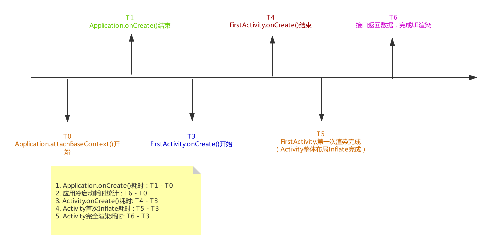

统计**应用冷启动时长**、**页面渲染时长**是`APM`系统不可缺少一个功能。[Rabbit](https://github.com/SusionSuc/Rabbit)的这个功能实现的思路主要参考[Android自动化页面测速在美团的实践](https://tech.meituan.com/2018/07/12/autospeed.html),目前已经完成了下面功能点:

1. `Application.onCreate`耗时统计
2. 应用冷启动耗时统计
1. `Activity.onCreate`耗时统计
2. `Activity`首次`inflate`耗时统计
3. `Activity`首次渲染耗时

上面统计时间具体情况如下图:



最终输出的效果如下:


>下面就一起来看一下大概实现原理

## 应用onCreate耗时统计

实现思路很简单:

1. 编译应用时在`Application.attachBaseContext()开始`和`Application.onCreate()结束`方法中插入耗时统计代码。
2. SDK收集测速数据，然后展示。

>对于编译时的字节码插入本文就不做详细实现分析，具体实现可以参考**Rabbit**源码中的实现,最终插入效果如下:

```
public class CustomApplication extends Application {

    protected void attachBaseContext(Context base) {
        AppStartTracer.recordApplicationCreateStart();
        super.attachBaseContext(base);
    }

    public void onCreate() {
        super.onCreate();
        Rabbit.init(this);
        AppStartTracer.recordApplicationCreateEnd();
    }
}
```

## 页面渲染耗时统计

什么时候才算页面渲染完成呢？

这里定义`Activity`的`ContentView`绘制完成就是**页面渲染完成**,我们可以通过监听`ViewGroup.dispatchDraw()`来监听`Activity.ContentView`绘制完成。具体实现思路是: **手动为`Activity.setContentView()`设置的View添加一层自定义父View，用于计算绘制完成的时间**

```
public class ActivitySpeedMonitor extends FrameLayout {

    @Override
    protected void dispatchDraw(Canvas canvas) {
        super.dispatchDraw(canvas);
        RabbitTracerEventNotifier.eventNotifier.activityDrawFinish(getContext(), System.currentTimeMillis());
    }

    public static void wrapperViewOnActivityCreateEnd(Activity activity) {
        FrameLayout contentView = activity.findViewById(android.R.id.content);
        ViewGroup contentViewParent = (ViewGroup) contentView.getParent();

        if (contentView != null && contentViewParent != null) {
            ActivitySpeedMonitor newParent = new ActivitySpeedMonitor(contentView.getContext());
            if (contentView.getLayoutParams() != null) {
                newParent.setLayoutParams(contentView.getLayoutParams());
            }
            contentViewParent.removeView(contentView);
            newParent.addView(contentView);
            contentViewParent.addView(newParent);
        }
    }
}
```

上面`ActivitySpeedMonitor.wrapperViewOnActivityCreateEnd()`代码会在编译时插入在`Activity.onCreate`方法中:

```
public class TransformTestActivity extends AppCompatActivity {

    protected void onCreate(Bundle savedInstanceState) {
        ActivitySpeedMonitor.activityCreateStart(this);
        super.onCreate(savedInstanceState);
        this.setContentView(2131296286);
        ActivitySpeedMonitor.wrapperViewOnActivityCreateEnd(this);
    }

}
```

## Activity首次inflate耗时统计

我们知道`ViewGroup.dispatchDraw()`方法在`ViewTree`发生改变时就会调用，而一般第一次会导致`dispatchDraw()`被调用代码是:

```
setContentView(R.layout.activity_transform_test);
```

因此`Rabbit`将`Activity`的第一`dispatchDraw()`方法完成的时间当做`Activity.setContentView(R.layout.activity_transform_test)`的耗时。

>其实这个时间的长短可以代码`Activity`的布局复杂度。

## Activity首次渲染耗时

这个耗时统计的时间结束点为: **页面发起网络请求并拿到数据，然后导致页面渲染完成**

举个例子，比如你的应用首页有3个接口，这3个接口的数据组成了整个首页的UI。因此**首页的渲染耗时**应定义为**3个接口完成请求，并数据渲染完成**。

`Rabbit`中对页面的渲染耗的统计需要配置，即配置一个页面哪些接口完成才算页面渲染完成, 具体配置形式如下。

>在`assest`文件夹下提供`page_api_list.json`文件:

```
{
  "home_activity": "MainActivity",  
  "page_list": [
    {
      "page": "MainActivity",
      "api": [
        "xxx/api/getHomePageRecPosts",
        "xxx/api/getAvailablePreRegistrations",
        "xxxx/api/appHome"
      ]
    }
    ...
  ]
}
```

`Rabbit`会在指定的所有接口都完成，并且`ViewGroup.dispatchDraw()`方法完成记录下这个时间点来作为渲染耗时:

>RabbitAppSpeedMonitor.java
```
fun activityDrawFinish(activity: Any, time: Long) {
    val apiStatus = pageApiStatusInfo[currentPageName]
    if (apiStatus != null) {
        if (apiStatus.allApiRequestFinish()) { //所有请求已经完成
            pageSpeedCanRecord = false
            pageSpeedInfo.fullDrawFinishTime = drawFinishTime
            RabbitDbStorageManager.save(pageSpeedInfo)
        }
    }   
}
```


### 如何统计接口完成呢？

`Rabbit`目前只支持`OkHttp`网络框架的接口完成统计, 主要通过`RabbitAppSpeedInterceptor`:

```
class RabbitAppSpeedInterceptor : Interceptor {
  override fun intercept(chain: Interceptor.Chain): Response {
        val request = chain.request()
        val response = chain.proceed(request)
        RabbitTracer.markRequestFinish(request.url().url().toString()) //标记一个接口完成请求
  }
}
```

## App冷启动耗时统计

结合上面的叙述，`Rabbit`定义**App冷启动耗时**为**HomeActivity渲染完成时 - Application.attachBaseContext()开始时**。

对于`HomeActivity`可以通过`page_api_list.json`进行配置:


```
{
  "home_activity": "MainActivity",  
  "page_list": [
    {
      "page": "MainActivity",
      "api": [
        "xxx/api/getHomePageRecPosts",
        "xxx/api/getAvailablePreRegistrations",
        "xxxx/api/appHome"
      ]
    }
    ...
  ]
}
```


## 总结

**应用测速组件**的实现原理并不是很复杂，不过还是涉及到了很多点。具体实现逻辑可以参考 : [Rabbit](https://github.com/SusionSuc/Rabbit)

>欢迎关注本人微信公众号: 


